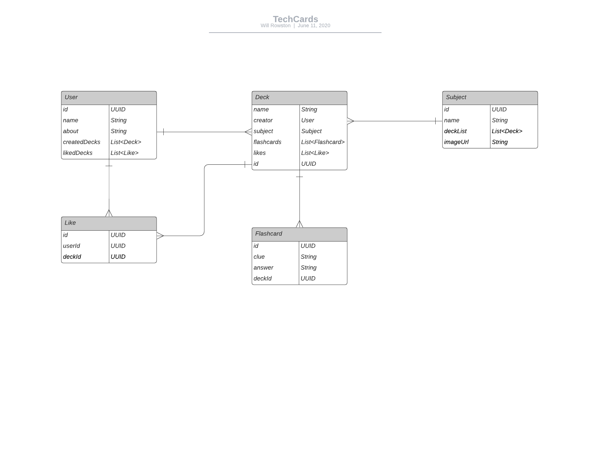
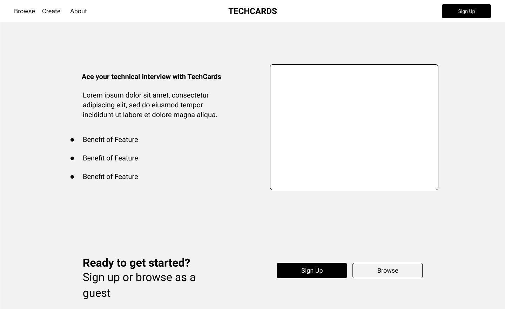
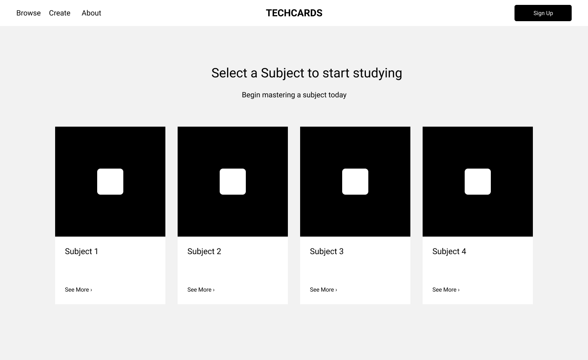
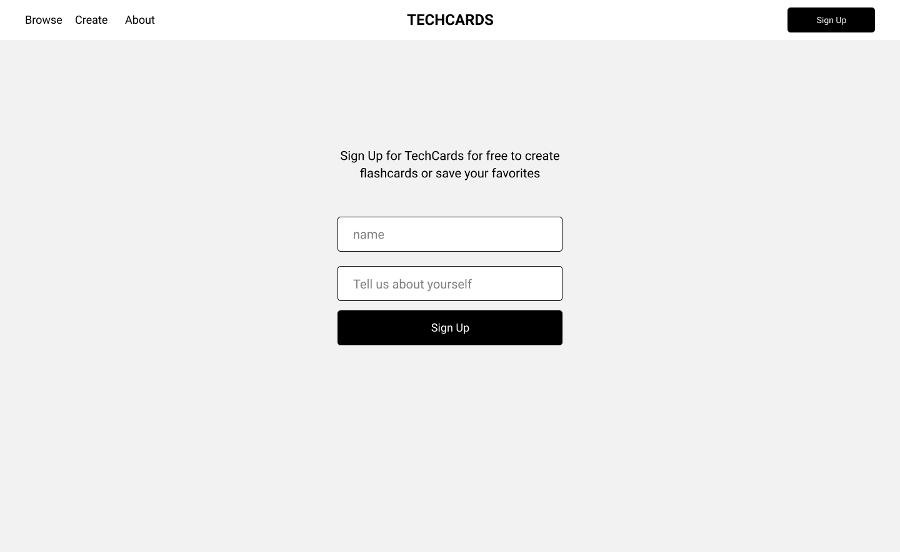
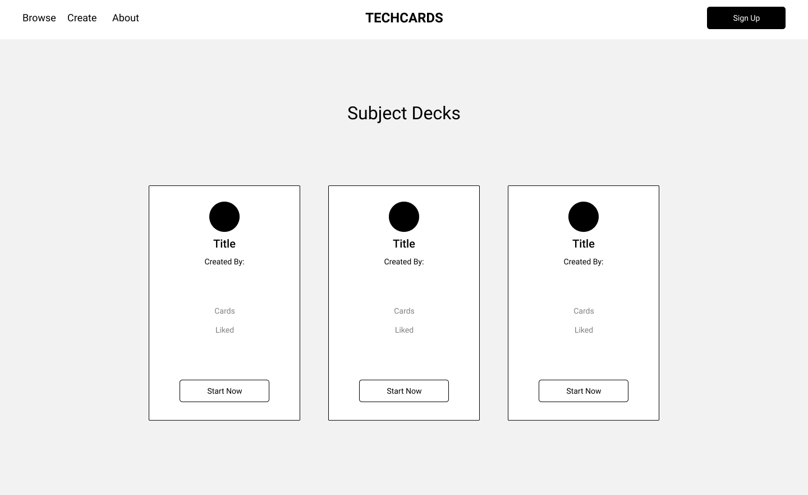
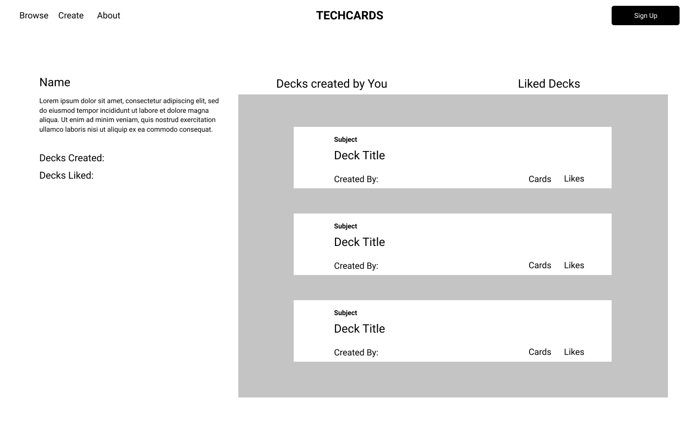
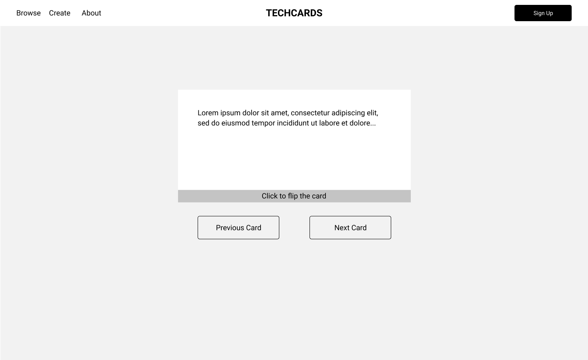

# TechCards

TechCards provides learning and studying tools for software engineers preparing for technical interview.

### Important Links

* [Deployed App](https://mysterious-stream-35285.herokuapp.com/) via Heroku
* [Trello Board](https://trello.com/b/gH2YZahL/techcards)
* [Frontend GitHub](https://github.com/wrowston/techcards-frontend)

### Technnical Details

* __Technologies Used:__ Java, Spring Framework, Spring Boot, Maven, PostgresSQL, JavaScript, React, Node.js, HTML5, CSS, Bootstrap, Heroku
* __5 Models:__ a user (user), a collection of subjects (subjects), a collection of decks that belongs to a specific subject (decks), a collection of flashcards that belongs to a specific deck (flashcard), and likes that are associated with users and decks (like)
* __RESTful routes__ for each model (GET, POST, PUT, DELETE) 
* __PostgresSQL__ used to store and retrieve data
* __MVC architecture__ used to structure program design
* __SQL queries__ used to interact with the database
* __Used promises and axios__ for more complex database queries s
* __Used React__ to render components
* Styled with __CSS and Bootstrap__
* Deployed with Heroku

### ERD 

### Wireframes

